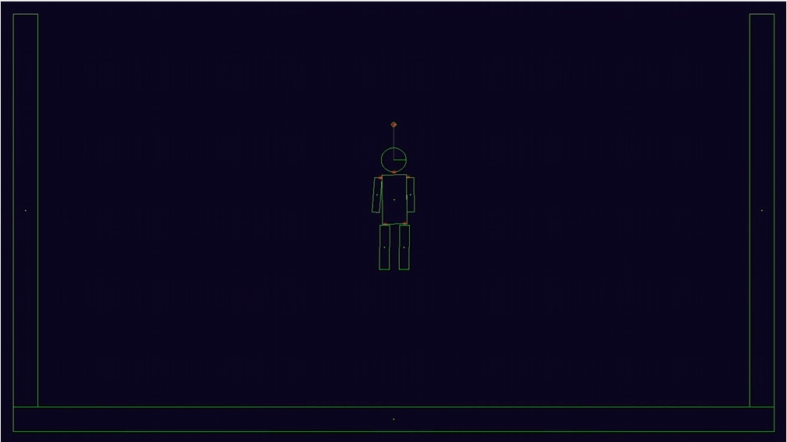

# 2D Game Physics Engine

## Overview
This project is a simple 2D physics engine built from scratch in C++. It follows the concepts taught in a this online course: [Game Physics Engine Programming Course](https://pikuma.com/courses/game-physics-engine-programming). , covering fundamental physics principles such as vectors, forces, rigid body dynamics, and collision detection.

The goal of this project is to provide an introduction to the world of 2D game physics by implementing key concepts from first principles.

## Features
- **Particle Simulation**: Simulates movement, forces, displacement, and integration.
- **Rigid Body Dynamics**: Adds shapes (circles, rectangles, polygons) to objects and implements physics interactions.
- **Collision Detection & Resolution**: Detects and resolves collisions between rigid bodies.
- **Physics Constraints**: Implements joints, ragdolls, and other constraints to improve engine stability.
- **Forces & Friction**: Applies gravity, drag, and friction to objects for realistic simulation.
  
Full demo            |  Raggdoll demo
:-------------------------:|:-------------------------:
  |  

## Topics Covered
- Vectors & Matrices
- Velocity & Acceleration
- Newtonian Mechanics
- Rigid Body Dynamics
- Collision Detection & Resolution
- Constraints & Joints
- Basic Calculus for Physics Simulations

